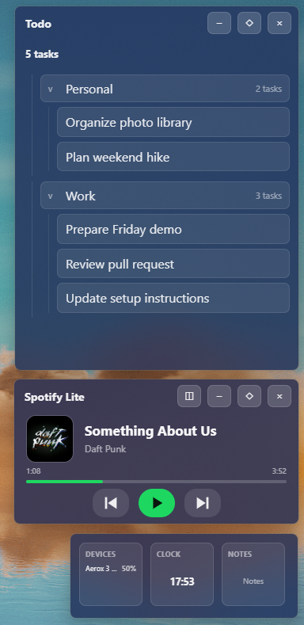
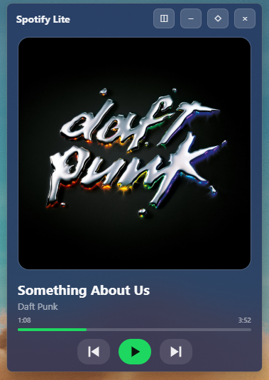
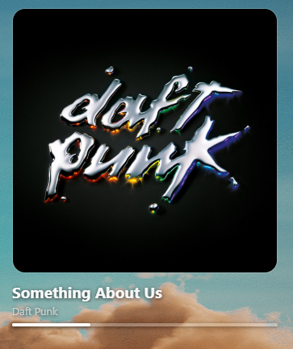
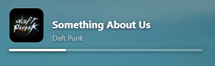
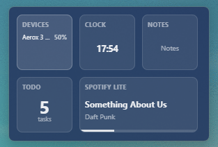

# Widgets Shell

**A personal Windows desktop workspace with floating widgets, Markdown tasks, and Spotify controls.**

Widgets Shell is an Electron application for keeping small everyday tools close at hand. Open individual widgets, pin them above other windows, arrange them in a dock, and restore your layout across sessions. The project combines a JavaScript interface with native Windows integration for media events and desktop window behavior.

## Preview

The widgets can be used as independent floating windows or collected into a compact dock. This example shows the Markdown Todo widget, Spotify Lite with playback controls, and a dock containing the device, clock, and notes widgets.

<p align="center">
  
</p>

### Spotify Lite layouts

Spotify Lite adapts from a full player with controls to frameless desktop layouts and a small dock tile.

| Full player | Frameless artwork |
| :---: | :---: |
|  |  |

| Compact desktop player | Widget dock |
| :---: | :---: |
|  |  |

*Spotify metadata and artwork are displayed from the signed-in user's Spotify session.*

## Widgets and features

- **Clock:** a compact desktop clock.
- **Notes:** persistent plain-text notes.
- **Todo:** Markdown files organized into collapsible folders, with task creation, editing, deletion, and drag-and-drop moves between groups.
- **Devices:** connected-device information and battery levels where Windows or the device exposes them.
- **Spotify Lite:** artwork, track information, playback progress, seeking, and previous/play-pause/next controls.
- **Window controls:** tray access, pinning, desktop mode, docking, appearance settings, and saved window positions.
- **Autostart:** optional startup with Windows.

The System entry is currently a placeholder, not a complete system-monitor widget.

## What works without external accounts

Clock, Notes, Todo, Devices, window management, docking, appearance settings, and autostart work without an online account. Spotify Lite is optional and remains disconnected until credentials are configured.

Todo does not require Obsidian. Use the gear button in the Todo title bar to select any local folder and choose between plain Markdown notes or an optional Obsidian template.

## Run from source

Use Windows with a recent Node.js installation and npm. Automated checks were run with Node.js 24.16.0. The native helper requires Visual Studio or Build Tools with the **Desktop development with C++** workload and a Windows SDK supporting C++/WinRT.

From the repository root:

```powershell
npm ci
npm start
```

The application can start without `settings.local.json`. Create it from the example only when you want to configure Spotify or edit paths manually:

```powershell
Copy-Item settings.example.json settings.local.json
```

Leave the Spotify fields empty if you do not use Spotify Lite.

To build the Windows helper, open an **x64 Native Tools Command Prompt for Visual Studio**, change to the repository root, and run:

```text
npm run build:media-session
```

The helper is built as `native/windows-media-session/windows-media-session-v3.exe`. Generated executables are intentionally excluded from Git. Existing copies in a development folder are local build artifacts; a clean checkout needs the build step for full native functionality. No installer or release-packaging workflow is currently configured.

## Local settings

`settings.local.json` is read from the application root. It is ignored by Git. Start from [settings.example.json](settings.example.json), which contains no credentials.

| JSON field | Environment override | Purpose |
| --- | --- | --- |
| `spotifyClientId` | `SPOTIFY_CLIENT_ID` | Your own Spotify application client ID. |
| `spotifyClientSecret` | `SPOTIFY_CLIENT_SECRET` | Your own Spotify application client secret. |
| `todoRootPath` | `WIDGETS_TODO_PATH` | Folder containing your Markdown tasks. |
| `todoTemplatePath` | `WIDGETS_TODO_TEMPLATE_PATH` | Optional Obsidian-style template used when creating a task. Leave it empty for plain Markdown. |

Environment variables take precedence at startup. Restart the application after editing the JSON file or environment variables manually. Use forward slashes in JSON paths, or escape backslashes. This application does not load `.env` files.

## Markdown tasks

Open the Todo widget and select the gear button in its title bar, next to the dock, pin, and close controls. The settings dialog can:

- Select the folder where tasks are stored.
- Select an optional Markdown or Obsidian template.
- Switch back to plain Markdown by clearing the template.

These choices are saved to `settings.local.json` and take effect immediately. You can also configure the paths manually. With an empty `todoRootPath`, the application looks for `Widgets Tasks` under your Windows Documents directory.

- Each Markdown file represents one task; its filename is the task name.
- Subfolders become groups. File changes are watched automatically.
- Moving a task moves the actual file. Existing destination files are not overwritten.
- Deleting a task deletes its Markdown file, so use a dedicated folder or keep backups.
- `_Все дела.md` and `_Дела.md` are treated as index files and excluded from the task list.

When no template is selected, a new task is a regular Markdown file with an H1 title followed by the task text. It can be edited in any Markdown editor and does not require Obsidian.

For an Obsidian workflow, select a template such as the included [task template](examples/todo-template.md). The editor uses `### What needs to be done` or `### Что нужно сделать` as the task details section; if neither exists, it uses the content below the first H1 heading. Title and date template markers are supported, while arbitrary template scripts are not executed. In template mode, **Open note** uses Obsidian. In plain Markdown mode, it uses the Windows default application for `.md` files.

## Spotify setup

Spotify Lite is optional. This repository does not include shared Spotify credentials. Every user who enables the widget should create a personal Spotify developer application and keep its credentials local.

1. Create an application in the [Spotify Developer Dashboard](https://developer.spotify.com/dashboard) using your own account. Follow Spotify's [application setup instructions](https://developer.spotify.com/documentation/web-api/concepts/apps).
2. Register this exact redirect URI:

   ```text
   http://127.0.0.1:5000/callback
   ```

   The local callback uses port 5000. Spotify documents loopback redirect rules [here](https://developer.spotify.com/documentation/web-api/concepts/redirect_uri).
3. Copy your client ID and secret into your local settings or environment variables. Never put them into source files or the example configuration.
4. Restart Widgets Shell, open **Spotify Lite**, and connect through the browser authorization flow.
5. Use a Spotify account eligible for your developer application's current access mode. Development Mode applications have user and account restrictions, so check Spotify's current [quota-mode documentation](https://developer.spotify.com/documentation/web-api/concepts/quota-modes) if authorization is denied.

Spotify Lite controls an existing Spotify session; it does not stream music itself. Previous/play-pause/next use Windows media keys, while seeking uses the Spotify API. It requests playback-read and playback-modification scopes.

Windows media-session events drive updates instead of continuous Spotify polling. Track information is also refreshed when the widget opens, after navigation commands, and at an estimated track end. A bounded cache retains nearby tracks and artwork, and the last playback state can survive a restart.

This implementation currently uses the Authorization Code flow with a locally configured client secret. It is intended for personal use with your own developer credentials. Never commit `settings.local.json`, publish the secret, or bundle a shared secret into a release. Migrating to Spotify's [Authorization Code with PKCE flow](https://developer.spotify.com/documentation/web-api/tutorials/code-pkce-flow) would remove the client-secret requirement for a future distributable build, but users would still need a valid Spotify client ID.

## Stored data and privacy

Runtime files live under Electron's `app.getPath('userData')`, normally an application-specific directory under Windows AppData:

- `widgets.json`: window layout, appearance, pinning, and autostart settings.
- `notes.txt`: Notes widget content.
- `spotify-lite-auth.json`: OAuth access/refresh tokens.
- `spotify-lite-playback-cache.json`: recent playback state and cached artwork information.

Credentials stay in the main process, but local settings and token files are stored on disk; they are not an encrypted secrets vault. Markdown tasks remain in the folder you configure.

The repository ignore rules exclude credentials, runtime data, dependencies, rollback archives, and compiled binaries. Do not upload a ZIP of your whole development directory as a release.

## Current limitations

- Windows is the supported platform.
- The repository currently runs from source; no installer or portable release is configured.
- A clean checkout must build the native Windows media-session helper for full integration.
- Spotify Lite requires a personal Spotify developer application and local credentials.
- The System widget is a placeholder.

## Development

```powershell
npm test
```

Tests cover settings loading, Spotify lifecycle handling, device monitoring, media sessions and keys, window effects, state-save coordination, and resource cleanup. Automated tests use mocks; actual Bluetooth support, Spotify playback, and visual behavior need checks on Windows hardware.

```text
src/main/       Electron lifecycle, IPC, settings, file access, Spotify, Windows bridges
src/renderer/   Shared widget UI and styling
native/         C++ Windows media-session and window integration helper
scripts/        Native build and device probing utilities
tests/          Node.js regression tests
examples/       Generic Markdown task template
```

**Stack:** Electron · JavaScript · Node.js · HTML/CSS · C++/WinRT · PowerShell · Spotify Web API

This is a personal portfolio project. Some interface text and Markdown conventions are currently Russian, and Windows is the primary supported platform.
